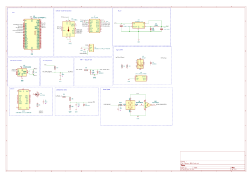

# Folks Sensor Boi

> Multi-sensor engine telemetry unit for gasoline vehicles. Collects six engine parameters and transmits them wirelessly to a companion app and over CAN bus.

---

## Overview

A compact, sealed sensor interface box designed to mount in the engine bay of a classic or modified gasoline vehicle. Built around the ESP32-WROOM-S3.

Designed for JLCPCB fabrication and SMT assembly. 

---

## Features

| Channel | Sensor / method | Interface |
|---|---|---|
| Exhaust / CHT temperature | K-type thermocouple (galvanically isolated) | SPI — MAX31856 |
| Engine RPM | Ignition coil primary (optocoupled) | GPIO interrupt |
| Wheel speed | Hall effect sensor + Schmitt trigger | GPIO interrupt |
| Oil temperature | NTC sender (VDO-type) | ADC |
| Manifold vacuum / MAP | MPXHZ6115A6T1 15–115 kPa | ADC |
| Battery voltage | Resistor divider | ADC |

**Outputs**
- WiFi 802.11 b/g/n (AP mode) + BLE 4.2 → companion app
- CAN 2.0B @ 500 kbit/s via SN65HVD230

**Programming**
- USB-C (CP2102N) with auto-reset circuit — no manual BOOT/EN required

---

## Schematic

<!-- schematic-start -->

<!-- schematic-end -->

---

## Hardware

### MCU
- **ESP32-WROOM-32U-N4** — dual-core 240 MHz, WiFi, BLE, TWAI CAN, SPI, 12-bit ADC
- External u.FL antenna for full-vehicle wireless range


---
)


```
├── hardware/
│   ├── engine-sensor-box.kicad_pro
│   ├── engine-sensor-box.kicad_sch
│   ├── engine-sensor-box.kicad_pcb
│   ├── sym-lib-table
│   ├── fp-lib-table
│   └── jlcimport/               # project-local imported symbols + footprints
├── production/
│   ├── gerbers/
│   ├── bom.csv                  # JLCPCB-format BOM
│   └── positions.csv            # CPL file
├── docs/
│   └── engine_sensor_box_BOM.xlsx
└── README.md
```

---

## BOM

<!-- bom-start -->
[Interactive BOM](docs/bom.html) — download and open locally for the interactive view.
<!-- bom-end -->

Full BOM with LCSC part numbers, stock status, unit costs, and placement tracking is in [`engine_sensor_box_BOM.xlsx`](engine_sensor_box_BOM.xlsx).


---

## Firmware

> Firmware repository: _link TBD_


---


